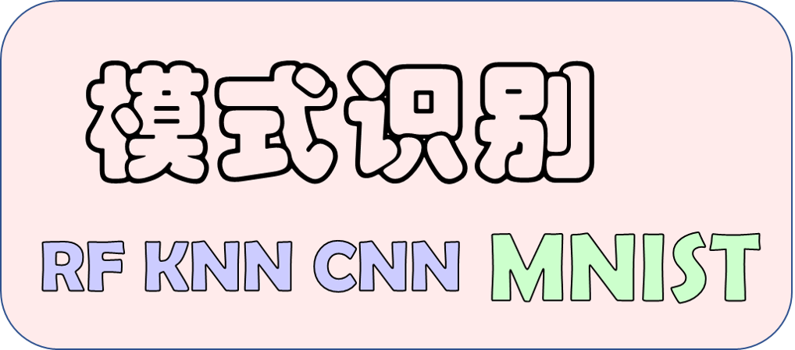

# 项目说明

本项目基于Python实现`KNN`, `RF`, `CNN`3种算法，完成`MNIST`数据集的识别。
⚠️本项目实现的算法与`MNIST`数据集高度相关，不具有通用性。

# 快速入门

用户可以通过命令行参数指定运行的算法以及各算法相关参数，若未指定任何算法，则依照默认参数依次使用`RF`, `KNN`, `CNN`算法对MNIST数据集进行分类，并输出分类模型在测试集上的准确率。

    # 依次使用RF, KNN, CNN算法对MNIST分类
    python main.py

> ps: 默认情况下会加载已训练的RF和CNN模型

通过子命令可以指定要运行的算法，可选子命令包括`rf`, `knn`和 `cnn`。

    # 仅使用cnn算法对MNIST分类
    python main.py cnn

指定子命令后，可以设置算法相关参数，各算法配置项如下所示。

## RF配置项

通过`--his`指定加载已训练模型，通过`--no-his`指定不加载已训练模型，默认情况下会加载已训练模型

    # 不加载已训练模型，重新训练模型
    python main.py rf --no-his

若重新训练模型，可以通过`--tree`指定RF中决策树的数量，默认为`10`。

    # 指定RF中决策树数量为20
    python main.py rf --no-his --tree 20

> ps: 若加载已训练模型，则决策树数量与已训练模型相同，此时`--tree`参数不会起作用

## KNN配置

KNN算法选择近邻中占比最多的类型作为测试样本类型，通过`--k`指定KNN中近邻数量，默认为`10`。

    # 指定KNN中近邻数量为20
    python main.py knn --k 20

由于KNN并不事先训练模型，因此在测试时速度较慢，可以通过`--count`指定测试样本数量，默认`100`。

    # 指定KNN中训练样本数量为200
    python main.py knn --count 200

## CNN配置

与RF类似，`--his`指定加载已训练CNN模型，`--no-his`指定不加载已训练模型，默认情况下会加载已训练模型。

    # 不加载已训练模型，重新训练模型
    python main.py cnn --no-his

CNN每训练一轮便会保存一次模型，通过`--checkpoint/--no-checkpoint`可以指定是否接着上次训练结果继续训练，默认重新训练，不接着上次训练的结果。

    # 接着上次保存的模型继续训练
    python main.py cnn --no-his --checkpoint

> ps: 若保持默认配置或通过`--his`指定加载已训练模型，则不会训练，因此`--checkpoint/--no-checkpoint`不会起作用

通过`--epochs`可以指定训练轮数，默认训练`100`轮。

    # 训练200轮
    python main.py cnn --epochs 200

通过`--lr`可以初始学习率，默认`1e-4`。

    # 初始学习率设置为1e-3
    python main.py cnn --lr 1e-3

通过`--drop`可以指定学习率衰减周期，默认`30`轮，每训练一个周期学习率下降为原来的`0.1`倍。

    # 每50轮学习率下降为原来的0.1倍
    python main.py cnn --drop 50

# 实验结果

默认配置下，各算法针对MNIST测试集的准确率如下表所示：

| RF     | KNN    | CNN    |
| ------ | ------ | ------ |
| 93.81% | 96.00% | 99.17% |

